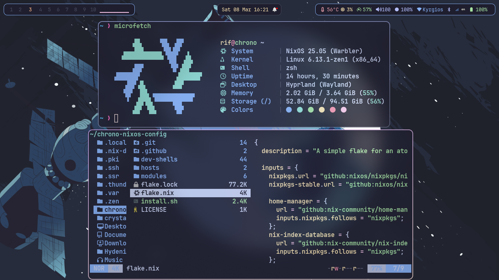

<h1 align="center">
   
   <br>
      Chrono NixOS Dotfiles
   <br>
       <br>
   <div align="center">
      
   <div align="center">
      <p></p>
      <div align="center">
         <a href="https://github.com/chrollorifat/chrono-nixos-config/stargazers">
            
         </a>
         <a href="https://github.com/chrollorifat/chrono-nixos-config">
            
         </a>
         <a = href="https://nixos.org">
            
            <!--  -->
         </a>
         <a href="https://github.com/chrollorifat/chrono-nixos-config/blob/main/LICENSE">
            
         </a>
      </div>
      <br>
   </div>
</h1>





# Few things to keep in mind

- Still a work in progress, don't just blindly copy. But you can use this as reference tho.
- This config is for Legacy Boot with MBR disk partitioning
- It uses Grub as a bootloader
- You can make the necessary changes to fit your setup in the hosts directory

# Installation
> [!Note]
> <p>You should review the configuration variables in flake.nix before installing.</p>
<!-- ## Using the install script -->
```bash
nix run --experimental-features "nix-command flakes" nixpkgs#git clone https://github.com/chrollorifat/chrono-nixos-config.git ~/NixOS
```
```bash
cd ~/NixOS
```
```bash
./install.sh
```
For a list of keybinds press Super + Shift + K
<details>
<summary>How to use the dev-shells</summary>

```bash
nix flake init -t ~/NixOS#NAME
```
or  use the "new" keyword to initialise a new directory
```bash
nix flake new -t ~/NixOS#NAME PROJECT_NAME
```
where NAME is any of the templates defined in dev-shells/default.nix
</details>

<!-- ## Building manually
> [!IMPORTANT]
> <p>When building manually from the flake make sure to place your hardware-configuration.nix in hosts/Default/<br>
> then change the username variable in flake.nix with your username!! THIS IS IMPORTANT<br>
> afterwards run the command below</p>
```bash
sudo nixos-rebuild switch --flake .#Default
``` -->
### Credits/Inspiration
https://github.com/Sly-Harvey/NixOS<br>
https://github.com/JaKooLit/Hyprland-Dots<br>
https://github.com/prasanthrangan/hyprdots
